# ATools4DoL

面向 [Degrees of Lewdity](https://www.degreesoflewdity.com/) 模组开发的 VSCode 扩展。

它把游戏的编译源码（`Degrees of Lewdity.html`）和汉化补丁（`i18n.json`）解析成可浏览、可补全、可跳转的索引，并提供 `boot.json` 的可视化编辑、模组打包与一键推送到游戏。


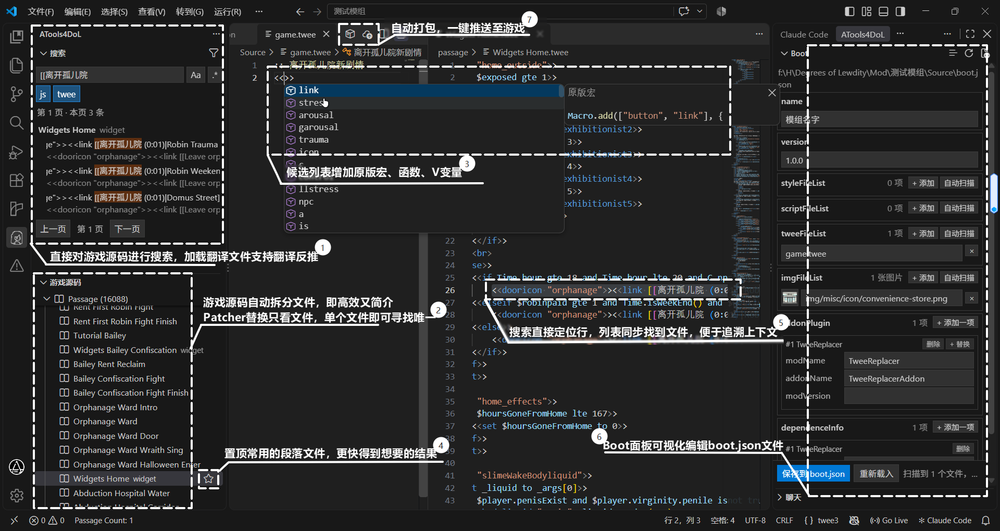


---

## 功能一览

### 一、搜索面板

- 类 VSCode 搜索界面，无替换功能，支持**中文模糊匹配**（输入中文即可命中对应英文原文）
- 结果**中文为主行、英文原文件为半透明副行**，匹配词高亮（只高亮命中的词，不高亮整行）
- 结果**分页**，每页 100 条，不再截断
- 搜索框下方是常驻的 **JS / twee 类型开关**，用于过滤结果
- 点击结果 → 自动在「游戏源码」树中展开并选中对应文件/段落
- 搜索过程有加载动画；命中文本自动滚动到面板中部
- **搜索区域固定在面板顶部**，浏览长结果时不随滚动条滚走
- 文件名不换行，超出用省略号


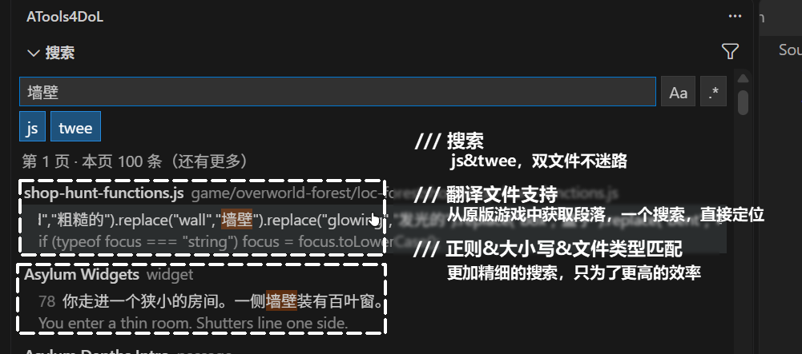


### 二、游戏源码浏览

- 侧边栏「游戏源码」把编译源码拆成 **JS 文件** 与 **Passage** 两类，均为可折叠卡片，按需渲染（1.6 万段落也不卡）
- 顶部 **收藏分组**：右键卡片「收藏 / 取消收藏」，状态持久保存，数量实时显示
- 标题栏下拉菜单（配置）+ 刷新 + 频率统计按钮 + **文件名筛选**（点放大镜弹出输入框，留空显示全部）
- 右键文件/文件夹可「不检查此文件 / 此文件夹」


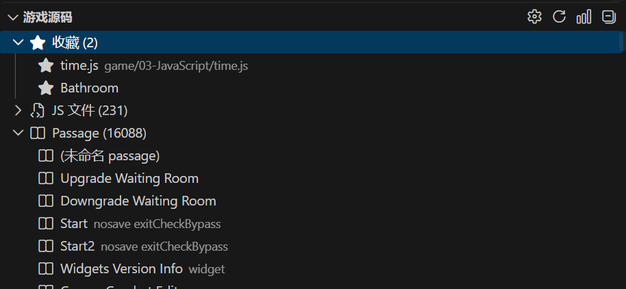


### 三、悬停预览与跳转定义

- **按住 Ctrl + 点击** 直接跳转
- 悬停显示定义处的原始代码，代码块使用 `twee3` 语法高亮
- 支持跳转的对象：
  - **宏**：`<<widget "xxx">>`、`Macro.add("xxx")`、`DefineMacro(...)`、数组批量注册
  - **函数**：含对象方法 `xxx: function()`、对象展开赋值 `Obj = { ...Obj, method: function(){} }`、`<<run 对象.方法()>>`
  - **链接段落**：`[[显示|段落]]`、`[[段落<-显示]]`、`[[显示->段落]]`、`[[段落]]`、`[[显示][Setter]]`，工作区段落与游戏源码段落都支持
- 跳转后联动游戏源码树自动定位到对应条目


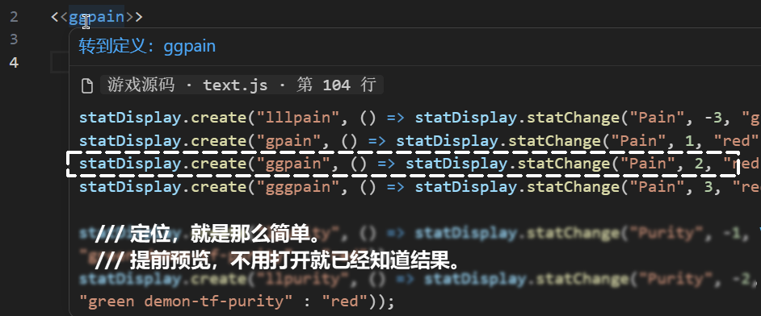


### 四、源码中文 / 英文切换

- 状态栏右侧的 **中文 / 英文** 按钮一键在中文译文与英文原文之间切换（中文模式下按钮常亮）
- 中文模式下文件置为只读，编辑保存时会反向翻译回英文再生成补丁


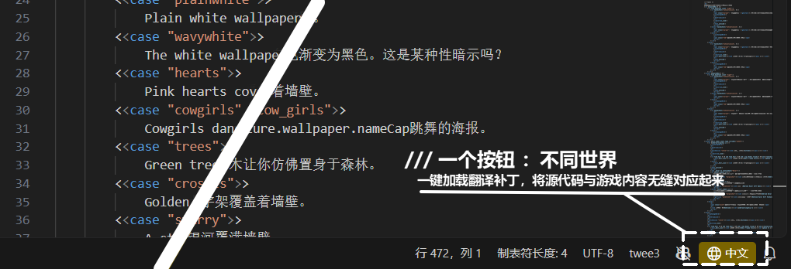


### 五、twee 语法检查

- 校验 `<<` / `>>` 括号是否配对
- **容器宏闭端检查**：`<<if>>`、`<<switch>>`、`<<widget>>`、`<<link>>`、`<<for>>`、`<<replace>>`、`<<button>>`、`<<addinlineevent>>` 等必须有闭端；缺失报错，并提供**快速修复**（一键补 `<</宏名>>`）
- **输入宏名后的空格时自动补闭端**：写下 `<<if `（空格）后自动补成 `<<if >>` + 换行 `<</if>>`（VSCode / twee3 会自动配对出 `>>`，不需要手动敲；没有自动配对时也会顺手补上 `>>`）
- **参数检查**：`<<if>>` / `<<switch>>` 缺条件、`<<for>>` 缺循环参数、`<<set>>` 缺赋值、`<<widget>>` 缺名称、`<<elseif>>` 缺条件
- **`<<else>>` / `<<elseif>>` 必须位于 `<<if>>` 结构内**，闭端名字不匹配（如 `<</if>>` 去关 `<<for>>`）会报错
- **重名检查**：同一文件里 `<<widget "x">>` 重名、`:: 段落名` 重名
- 标红**未定义的宏**（原版宏与 `<<widget>>` 里都找不到）
- 标红**不存在的段落**跳转目标
- 跳转目标是变量（如 `_args[1]`、`$passage`）时自动跳过
- 可用 `atools4dol.excludeGlobs` 指定不检查的文件


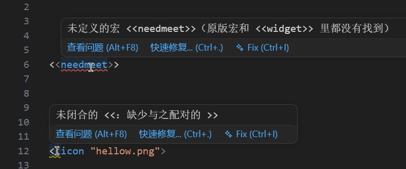


### 六、boot.json 可视化编辑

侧边栏「boot」把 `boot.json` 渲染成表单，所有分区都是可折叠卡片，并记住展开状态。

- **选择 boot.json**：标题栏按钮列出项目内所有 `boot.json`，直接指定目标（也可用 `atools4dol.bootPath` 配置）
- **创建默认 boot.json**：不存在时一键生成模板
- 各类文件列表（`styleFileList` / `scriptFileList` / `scriptFileList_inject_early` / `scriptFileList_preload` / `tweeFileList` / `imgFileList` / `additionFile` …）支持增删、**自动扫描**、**按类型的路径补全**（css / js / twee / 图片 / 全部）
- **imgFileList 缩略图**：每个路径旁显示固定高度、等比缩放的预览，悬浮查看完整大图
- 底栏「保存到 json」按钮：未修改时可用但为次级配色，与「重新载入」一致；写入成功后提示形如「已写入 …/boot.json」
- **未保存退出可恢复**：面板收起后网页会被销毁，编辑过程中的改动会临时存下来；下次打开面板时若与 `boot.json` 有差异，弹出「是否恢复未保存的修改？（尚未写入 boot.json）」；点「重新载入」等于放弃当前编辑并清掉这份临时数据


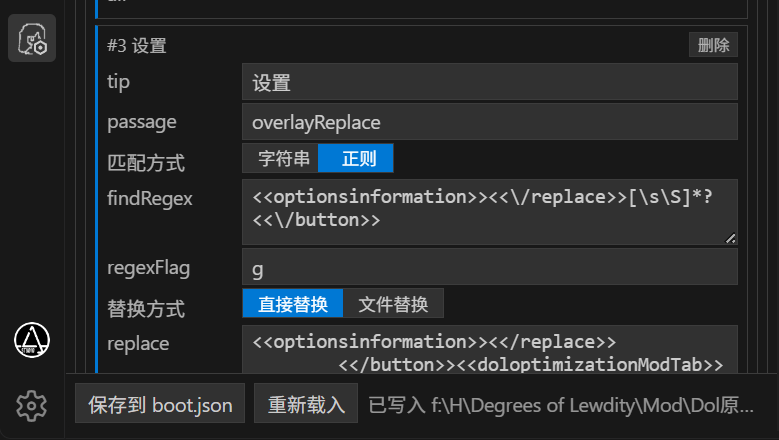


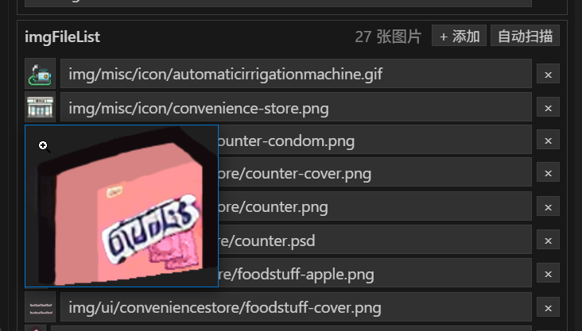


#### addonPlugin 专用编辑器

按 `addonName` 自动切换为对应的编辑器，切换类型时保留已有数据、不丢未知字段：

| addonName | 编辑方式 |
|---|---|
| `BeautySelectorAddon` | 仅 `type` 字段，不提供添加参数 |
| `TweeReplacerAddon` | 单个「+ 替换」按钮，条目内两组**无圆角蓝色开关**：`字符串 / 正则匹配`、`直接替换 / 文件替换`；文件替换的路径框带补全 |
| `ReplacePatcherAddon` | `params` 分成 `js` / `twee` 两组，各自增删，条目含 `fileName` / `passageName`、`from`、`to` |
| `I18nTweeReplacerAddon` | 标量字段 + `findLanguageFile` / `replaceLanguageFile` 数组编辑器 |
| 其他未知 addon | 回退到通用编辑器（数组显示为子列表、布尔为勾选框、对象为 JSON 框、其余为文本框） |


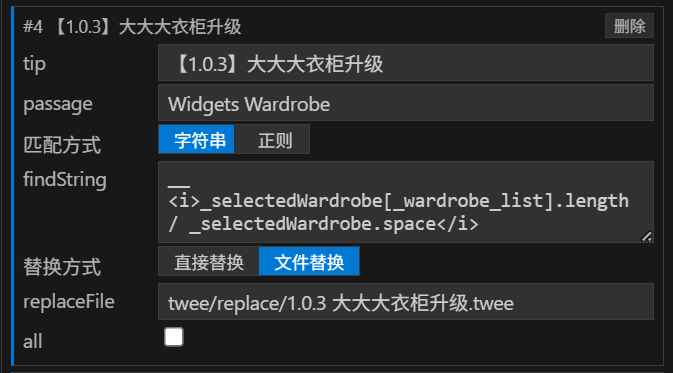


#### 锚点校验

编辑时自动校验 `TweeReplacer` / `ReplacePatcher` 的锚点能否在游戏源码中命中，未命中的输入框**标红并悬浮提示**（如「在该 passage 中未找到该锚点」）。


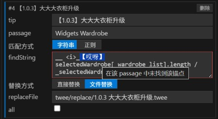


### 七、自动 patch（直接编辑源码即生成补丁）

在「游戏源码」里打开的 **passage 是可编辑的虚拟文档**，改完保存不用手写补丁。

- **改动区背景高亮**：虚拟文档里被你改动的部分用编辑器主题色高亮，一眼看到改了什么
- **保存即生成补丁**：保存时自动求「该 passage 内最短唯一锚点」，把改动写成 `boot.json` 里 `ReplacePatcher` 的 `from` / `to` 条目
- **安全锚点**：锚点边界避开会被 `i18n.json` 翻译覆盖的裸文本与字符串，优先落在宏、HTML tag、标识符、注释上；并且**优先只朝一个方向延伸**——两侧都要吃上下文时，别的模组只要改到任意一侧锚点就失配了
- **对齐宏边界**：锚点会向外撑到完整的 `<<…>>`，不会停在 `<<widget "gdrug` 这种宏中间
- **找不到唯一锚点就不写**：宁可提示失败，也不生成会在翻译或别的模组改动后失配的锚点
- CodeLens 上的两个操作（改动行的上方）：
  - **保存为文件（改为文件替换）**：把该 passage 的改动从内联补丁改成 `TweeReplacer` 的 `replaceFile`，内容写入你指定的文件；之后**改虚拟文档会同步写回该文件**
  - **撤销更改（恢复游戏原文）**：丢弃该 passage 的改动，并删掉 `boot.json` 里对应的补丁 / 文件替换条目

> 中文模式下虚拟文档只读，需先切回英文再编辑；中文模式保存时会先把译文还原成英文，再生成补丁。
> 已经写进 `boot.json` 的旧补丁不会自动重写，重新保存一次该 passage 才会变成对齐后的形式。

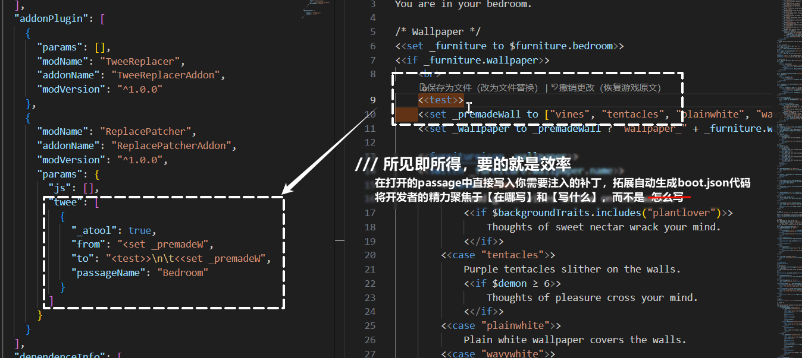

### 八、打包、推送与连接状态

- **打包**：编辑器标题栏的「打包」按钮，收集 `boot.json` 目录下的文件，用 terser 压缩 JS、压缩 CSS，打包为 `.zip`
- **推送到游戏**：通过本地 WebSocket `127.0.0.1:38471` 起把 zip 推给游戏，由游戏侧自动加载并重载
- **连接状态栏**：游戏连上后，VSCode 右下角出现绿点「已连接」，点它就等于「打包并推送」；没有连接时这个按钮不出现
- **多窗口**：每个 VSCode 窗口会自动占用 `38471` 起的第一个空闲端口（共 10 个），所以可以同时开多个窗口、各自连一个游戏实例
- 游戏未连接时弹出警告并提供「打开游戏」按钮


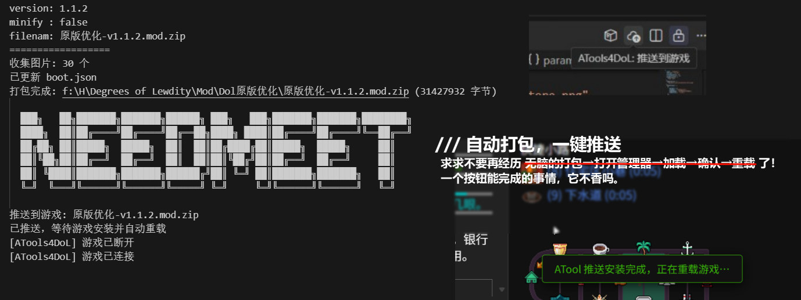


### 九、游戏内调试面板（游戏侧）

模组 `dol-debugger-mod` 在游戏页面右上角挂一个可拖动的 ATools4DoL 面板，用来不改代码就试宏、看变量。

- **连接状态**：面板标题显示「已连接 / 未连接」，多开时显示「已连接 (N个编辑器)」；绿点表示已连上
- **拖动 / 折叠**：按住标题栏拖动（松手自动吸附到最近的锚点并记住，位置按「锚点 + 像素」记，改窗口大小不会跑丢），原地单击折叠或展开，收起时有过渡动画
- **selector 框**（可空）：留空时宏的输出直接落在面板的输出区；填了就落到页面里匹配到的元素上；输入 `#` 列出页面里所有 id、输入 `.` 列出所有类名，可上下键挑选
- **SugarCube 代码框**：
  - `twee3` 语法高亮（注释 / 宏 / 链接 / 字符串 / `$变量` / `setup`）
  - 补全：`<<` 出宏名，`$` 出存档变量；`$player.`、`setup.`、`V.`、`State.` 会出对象成员——**在游戏里即时求值**，像浏览器控制台一样拿到真实键。上下键选择，回车或 Tab 采纳
  - 输入 `<` 自动配对成 `<>` 并把光标放在中间（仅当右侧是 `>`、空格或文末）；光标停在 `<|>` 上按退格会把这一对尖括号一起删掉
  - 补全与配对都走原生输入，**Ctrl+Z 可以撤销**
- **执行 / 刷新**：
  - 「执行」把代码框内容交给游戏的 `Wikifier` 跑一遍；每次执行都会在输出区显示一行耗时（时间 + 毫秒），保证按下就一定有反馈
  - 「刷新」重新渲染当前 passage，让改过的变量 / 样式立刻生效
  - 代码框里 **Shift+Enter** = 执行；**400ms 内连按两次** = 执行一次并立刻刷新（第二次不再重复执行）；selector 框里按回车同样是执行
  - 元素选择器匹配不到时会提示「选择器未匹配到元素」


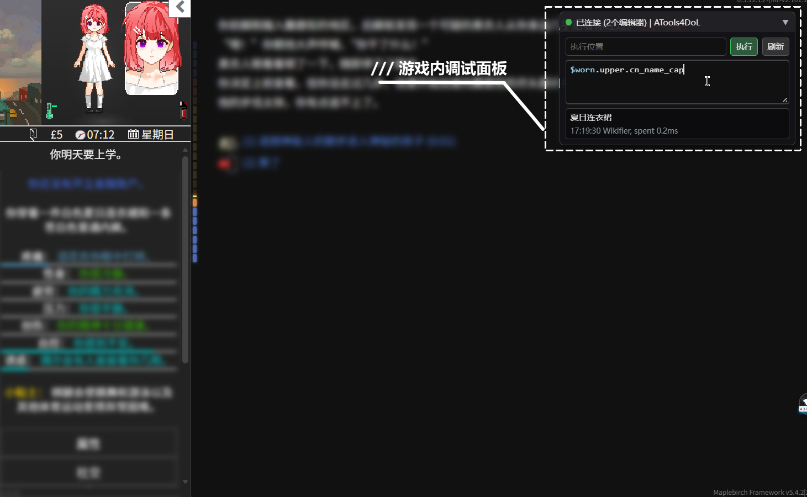


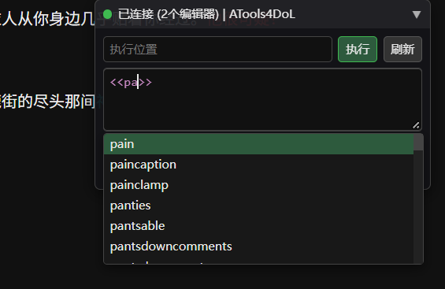


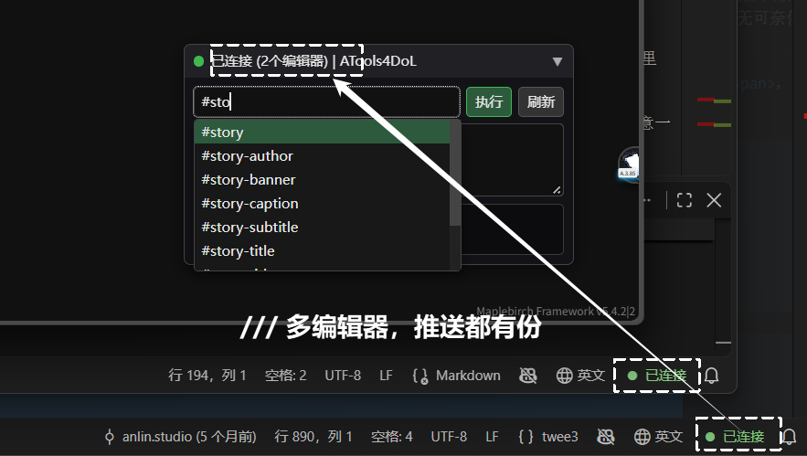


### 十、辅助功能与功能开关

- **￥ → £ / $**：在模组文件里输入中文人民币符号 `￥`（或 `¥`）会自动替换成 `£`（默认）或 `$`，也可在设置里选「关闭」
- 以下功能都可以在设置里单独关闭（默认全部开启）：
  - 下划线（宏、`[[段落]]` 的可点击链接）：**项目内 / 游戏源码** 分开关
  - Ctrl + 点击跳转定义与悬停预览：**项目内 / 游戏源码** 分开关
  - 自动补全、输入时自动补闭端、twee 语法检查、￥ 符号转换（可设为关闭）

> **门控**：扩展只在你确认的 DoL 项目里工作。当工作区（或 `atools4dol.bootPath` 指定的位置）存在 `boot.json` 时，「搜索 / 游戏源码」面板、状态栏中英切换按钮以及全部模组相关功能才会启用；没有 `boot.json` 时这些一律不出现。「boot」面板始终可见，方便你先创建或选择 `boot.json`。

### 十一、其他命令

| 命令 | 说明 |
|---|---|
| `ATools4DoL: 选择游戏源码 HTML` / `选择翻译补丁 JSON` | 指定本机源码与汉化文件（换游戏版本时用） |
| `ATools4DoL: 定位游戏源码文件 / 定位翻译文件` | 在系统资源管理器中定位文件（不做「打开文件夹」） |
| `ATools4DoL: 汉化反查源码位置` | 从中文文本反查它在源码中的位置 |
| `ATools4DoL: 生成 ReplacePatcher 锚点补丁` | 选中原文后生成「文件内最短唯一锚点」补丁并复制到剪贴板 |
| `ATools4DoL: 统计模组源码使用频率` | 扫描模组目录的 `.twee` / `.js`，统计宏/变量/函数使用频率，作为补全排序的基础分（补全排序还会叠加你的实际选择次数与时间衰减） |
| `ATools4DoL: 排除检查（哪些文件不检查）` | 编辑 `excludeGlobs`，命中的文件不显示诊断 |

大型文件（源码 HTML 约 50MB、汉化 JSON 约 65MB）超过 VSCode 限制时，会自动改用系统默认程序打开。

> **注意**：源码中英切换依赖 `twee3` 语法高亮插件，建议一并安装。

---

## 安装

### 方式一：安装已打包的 VSIX

1. 下载 `atools4dol-x.x.x.vsix`
2. VSCode → 扩展面板 → 右上角 `...` → **从 VSIX 安装…**
3. 或者在命令行执行：

```bash
code --install-extension atools4dol-0.0.1.vsix
```

### 方式二：从源码打包

```bash
cd vscode-extension
npm install
```

然后双击 `vscode-extension/[1] 打包.bat`，它会在 `vscode-extension/` 下生成 `.vsix`（内部执行 `npx --yes @vscode/vsce package --allow-missing-repository --skip-license`）。

## 快速开始

1. 用 VSCode 打开你的 DoL 模组目录（含 `boot.json` 的目录）
2. 扩展会自动检测工作区内的 `boot.json`
3. 通过「配置」菜单指定游戏源码 HTML 与汉化补丁 JSON
4. 左侧活动栏点击 ATools4DoL 图标：检测到 `boot.json` 后即可使用搜索 / 游戏源码 / boot 三个面板（没有 `boot.json` 时只显示 boot 面板，先在里面「创建默认 boot.json」或「选择 boot.json」）

## 配置项

| 配置 | 默认值 | 说明 |
|---|---|---|
| `atools4dol.gameSourcePath` | `**/Degrees of Lewdity.html` | 游戏源码 HTML 路径（绝对路径或工作区 glob） |
| `atools4dol.i18nPath` | `**/i18n.json` | 汉化数据 JSON 路径，用于汉化反查与中英切换 |
| `atools4dol.bootPath` | `**/boot.json` | 要编辑/写入的目标 `boot.json`；工作区有多个模组时用它锁定 |
| `atools4dol.statsPath` | `""` | 频率统计扫描的模组源码目录，留空则用工作区根目录 |
| `atools4dol.excludeGlobs` | `[]` | 不做错误检查的文件（glob），如 `**/测试模组/**` |
| `atools4dol.linkProject` | `true` | 工作区模组文件里的宏/段落下划线 |
| `atools4dol.linkSource` | `true` | 「游戏源码」虚拟文档里的下划线 |
| `atools4dol.gotoProject` | `true` | 工作区模组文件里的 Ctrl+点击跳转与悬停预览 |
| `atools4dol.gotoSource` | `true` | 「游戏源码」虚拟文档里的 Ctrl+点击跳转与悬停预览 |
| `atools4dol.completion` | `true` | 宏 / `$变量` / `setup.` 自动补全 |
| `atools4dol.autoClose` | `true` | 输入 `>>` 时自动补容器宏闭端 |
| `atools4dol.diagnostics` | `true` | twee 语法检查（闭端 / 参数 / 重名 / 未定义宏与段落） |
| `atools4dol.yenTo` | `gbp` | 输入 `￥` / `¥` 时替换成什么：`gbp` 英镑 `£` / `usd` 美元 `$` / `off` 不转换 |
| `atools4dol.safeAnchor` | `true` | 命令「生成 ReplacePatcher 锚点补丁」是否套用安全锚点；关闭后完全按选中原文生成。虚拟 passage 自动生成的补丁始终套用安全锚点 |

## 项目结构

```
.DoL ATools/
├─ vscode-extension/        # 扩展本体
│  ├─ extension.js          # 激活入口、boot 面板 webview、命令注册
│  ├─ gamedata.js           # 源码切分 / 索引 / 补全 / 跳转 / 诊断 / 汉化反查
│  ├─ packer.js             # 模组打包（terser 压缩 JS、压缩 CSS、zip）
│  ├─ server.js             # 本地 WebSocket，接收游戏连接、推送 zip
│  └─ media/                # 图标
├─ asapi/                   # 模组侧 API（AsAPI.js + 分发脚本）
├─ dol-debugger-mod/        # 调试用模组（游戏内调试面板 + 接收推送）
├─ utils/                   # 辅助脚本
└─ game-source/             # 本地游戏源码（已 gitignore，不入库）
```

## 说明

- 需要自备游戏的编译源码 HTML 与汉化补丁 JSON，扩展不做游戏文件的下载
- 源码解析基于编译后的 `Degrees of Lewdity.html`，检索 JS 文件与 twee 段落
- 索引带版本号，构建逻辑变化时会自动重建缓存

